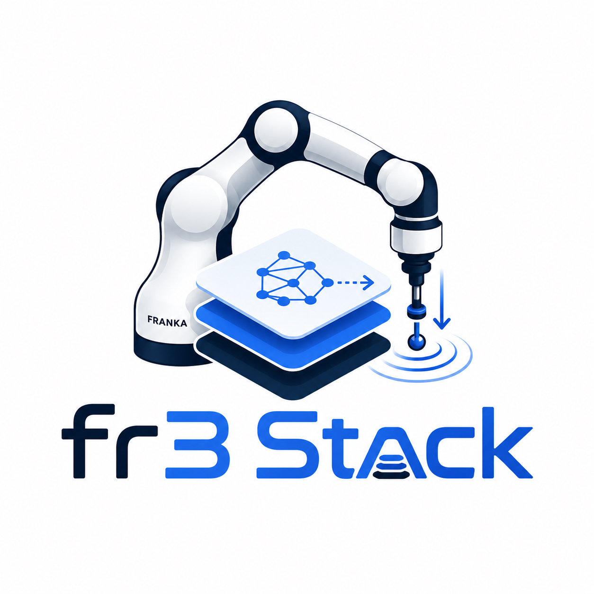

---
hide:
  - navigation
  - toc
---

  <header class="project-intro">
    

      
      

        
DexLab

        <h1>fr3-stack</h1>
        
Control suite for the  Franka Research 3.

      

    

    

      
A Python client on your workstation. A real-time C++ controller on the NUC. Connected through libfranka, without ROS.

      
Cartesian impedance, hybrid force/position control, and software-level dual-arm coordination.

      
<a class="project-primary" href="quickstart.html">Get started →</a><a href="https://github.com/Robot-Dexterity-Lab/fr3_stack">GitHub ↗</a>

    

  </header>
  

    <section class="project-start">
      <h2>Start with a connection</h2>
      
Set up the NUC daemon and install the Python client using the <a href="quickstart.html">installation guide</a>. Then read state from your workstation:

      
Python · Read robot state<pre><code>from fr3_stack import Robot

with Robot("192.168.1.8") as robot:
    state = robot.wait_for_state(timeout=5.0)
    print(state.pos, state.quat_xyzw)</code></pre>

      
Connect to the NUC's IP address. This example reads state only.

    </section>
    <section class="project-guides">
      <h2>Explore the stack</h2>
      <a class="guide-row" href="single-arm.html"><strong>Single-arm control</strong><small>State, poses, profiles, and Python interfaces</small>→</a>
      <a class="guide-row" href="controllers.html"><strong>Controllers</strong><small>Impedance, admittance, and force/position control</small>→</a>
      <a class="guide-row" href="dual-arm.html"><strong>Dual-arm coordination</strong><small>Two NUCs, paired targets, and fault handling</small>→</a>
      <a class="guide-row" href="troubleshooting.html"><strong>Troubleshooting</strong><small>Connections, F/T data, and build issues</small>→</a>
    </section>
  

  <footer class="project-bottom">
    
<strong>Development status</strong> — Dual-arm coordination provides paired dispatch and fault handling. NUC execution synchronization and real-robot evaluation are pending. <a href="dual-arm-coordination-plan.html">Roadmap →</a>

    
<a href="development.html">Contributing</a> · <a href="https://github.com/Robot-Dexterity-Lab/fr3_stack/blob/main/AGENTS.md">Agent guide</a> · <a href="https://github.com/Robot-Dexterity-Lab/fr3_stack/issues">Report an issue</a>

  </footer>

